# **The MSSP SOC Playbook**
# Created By : Mostafa Essam (0xMOSTA)

## **1. SOC Team Structure & Roles (Expanded)**

### **1.1 SOC Organizational Chart**

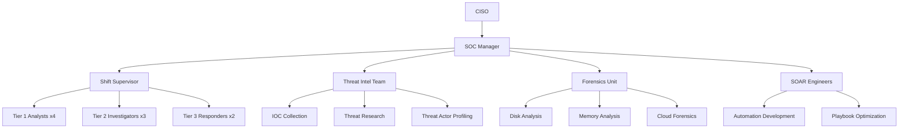

### **1.2 Role Breakdown**

**Tier 1 Analyst (Monitoring):**

- **Detailed Shift Schedule:**

  ```mermaid
  gantt
    title SOC Shift Rotation
    dateFormat  HH:mm
    section Day Shift
    Analyst 1 :a1, 06:00, 12h
    Analyst 2 :a2, 06:00, 12h
    section Night Shift
    Analyst 3 :a3, 18:00, 12h
    Analyst 4 :a4, 18:00, 12h
  ```

  ---

  **Tier 1 Analysts operate on a continuous 24/7 shift model** to ensure uninterrupted security monitoring. The schedule follows a simple yet effective two-team rotation pattern, with day shifts (6:00 AM - 6:00 PM) and night shifts (6:00 PM - 6:00 AM) providing full coverage. This 12-hour shift structure allows for comprehensive handovers between teams while maintaining operational consistency across time zones.

  **The shift rotation is strategically designed** to balance workload and prevent analyst fatigue. Day shifts are typically staffed by two analysts (Analyst 1 and 2) handling peak business hours when alert volumes are highest. Night shifts (Analyst 3 and 4) focus on critical alert triage and threat hunting during lower-traffic periods. This model ensures fresh personnel are always available while maintaining visibility across all time windows.

  **Key benefits of this schedule include:**  
  • Overlapping shift changes for proper knowledge transfer  
  • Equal distribution of day/night rotations to prevent burnout  
  • Built-in redundancy with dual analysts during high-risk periods  
  • Clear accountability with documented shift responsibilities  

  ---

  

  

  

- **Alert Triage Decision Tree:**

  ```mermaid
  graph TD
    A[New Alert] --> B{High Confidence?}
    B -->|Yes| C[Immediate Escalation]
    B -->|No| D{Medium Confidence?}
    D -->|Yes| E[Further Investigation]
    D -->|No| F[Mark as False Positive]
  ```

**Tier 2 Investigator (Analysis):**

- **Advanced Investigation Workflow:**

  1. **Timeline Reconstruction**:

     ```bash
     # Linux system timeline creation
     log2timeline.py /cases/case1/plaso.dump /evidence/
     ```

  2. **Malware Analysis Steps**:

     - Static Analysis: `strings malware.exe | grep -i "http"`
     - Dynamic Analysis: ANY.RUN sandbox execution

  3. **Lateral Movement Detection**:

     ```powershell
     # Detect PSRemoting sessions
     Get-WinEvent -LogName Microsoft-Windows-PowerShell/Operational | 
       Where-Object {$_.Id -eq 4103 -and $_.Message -match "New-PSSession"}
     ```

## **2. Incident Response Workflows**

### **2.1 Linux Attack Response (Expanded)**

**Advanced Attack Scenario:** 

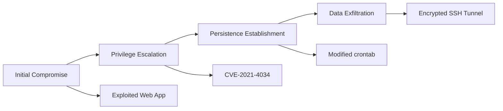

**Response Procedures:**

1. **Live Response Collection**:

   ```bash
   # Capture process tree
   ps -ef --forest > /evidence/process_tree.txt
   
   # Collect network connections
   netstat -tulnpe > /evidence/network_connections.txt
   ```

2. **Rootkit Detection**:

   ```bash
   # Check for hidden processes
   unhide-linux proc
   
   # Verify kernel modules
   lsmod | grep -i "evil"
   ```

3. **Memory Forensics**:

   ```bash
   # Capture full memory
   avml /evidence/memory.dump
   
   # Analyze with Volatility
   volatility -f /evidence/memory.dump linux_pslist
   ```

### **2.2 APT Incident Response**

---

## **2.2 Advanced Persistent Threat (APT) Incident Response**

### **APT Lifecycle Overview**


**Key Stages & Detection Methods:**

1. **Initial Access**  

   ```mermaid
   pie
       title Initial Access Vectors
       "Phishing" : 45
       "Exploits" : 30
       "Supply Chain" : 15
       "Other" : 10
   ```

   - *Detection:*  

     ```sql
     SELECT * FROM EmailLogs 
     WHERE attachment_hash IN (SELECT hash FROM ThreatIntel)
     ```

2. **Lateral Movement**  

   ```mermaid
   graph LR
       A[Compromised Host] -->|RDP| B[Server1]
       A -->|SMB| C[Server2]
       B -->|PsExec| D[Domain Controller]
   ```

   - *Detection:*  

     ```powershell
     Get-WinEvent -LogName Security | Where-Object {
       $_.ID -eq 4624 -and $_.Message -match "logon type 3"
     }
     ```

3. **Exfiltration**  

   ```mermaid
   pie
       title Exfil Methods
       "DNS Tunneling" : 40
       "Cloud Storage" : 30
       "Encrypted HTTP" : 20
       "Other" : 10
   ```

   - *Detection:*  

     ```kql
     NetworkLogs | where BytesSent > 100MB | sort by Time desc
     ```

---

### **Hunting Techniques**

#### **1. Scheduled Task Analysis**

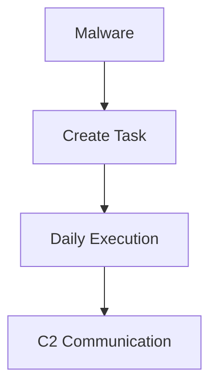

**Command:**  

```powershell
Get-ScheduledTask | 
  Where-Object { $_.Author -notmatch "Microsoft|Local Service" }
```

#### **2. WMI Persistence**

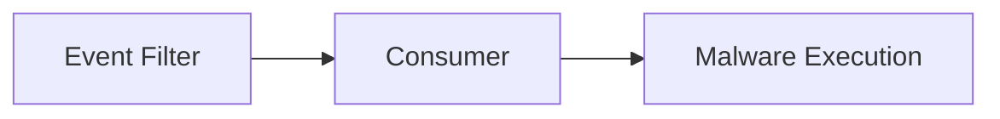

**Detection:**  

```powershell
Get-WmiObject -Namespace root\Subscription -Class __EventFilter
Get-WmiObject -Namespace root\Subscription -Class __EventConsumer
```

#### **3. Memory Artifacts**

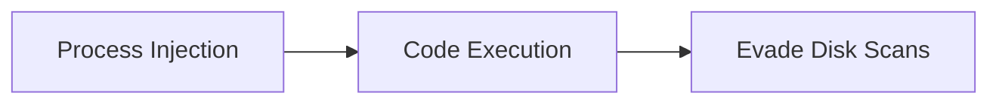

**Tool:**  

```bash
volatility -f memory.dump malfind
```

---

### **APT Response Checklist**

| Phase             | Action              | Tools                  |
| ----------------- | ------------------- | ---------------------- |
| **Containment**   | Isolate endpoints   | EDR, NAC               |
| **Investigation** | Timeline analysis   | Plaso, KAPE            |
| **Eradication**   | Remove persistence  | Autoruns, Sysinternals |
| **Recovery**      | Credential rotation | AD, Azure AD           |

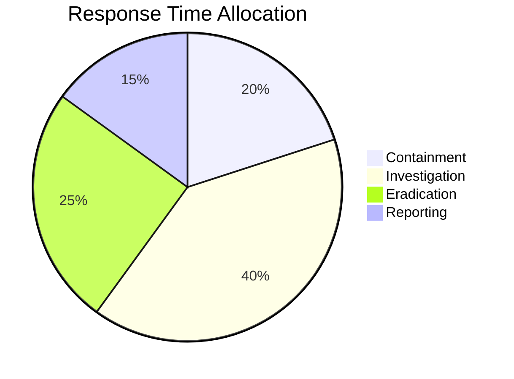

---

### **Why This Matters**

- APTs average **240 days** dwell time before detection (Mandiant 2023)
- **78%** use legitimate tools (Living-off-the-Land)
- **43%** target cloud environments

**Pro Tip:**  

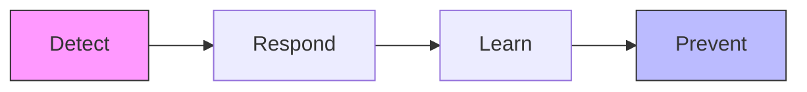


**APT Lifecycle Diagram:**

```mermaid
graph LR
    A[Reconnaissance] --> B[Initial Access]
    B --> C[Execution]
    C --> D[Persistence]
    D --> E[Privilege Escalation]
    E --> F[Defense Evasion]
    F --> G[Credential Access]
    G --> H[Discovery]
    H --> I[Lateral Movement]
    I --> J[Collection]
    J --> K[Exfiltration]
```

**Hunting Techniques:**

1. **Scheduled Task Analysis**:

   ```powershell
   Get-ScheduledTask | Where-Object {$_.TaskPath -notmatch "Microsoft"}
   ```

2. **WMI Persistence Hunting**:

   ```powershell
   Get-WmiObject -Namespace root\Subscription -Class __EventFilter
   Get-WmiObject -Namespace root\Subscription -Class __EventConsumer
   ```

3. **DNS Exfiltration Detection**:

   ```sql
   SELECT * FROM DNS_Logs 
   WHERE query_length > 100 
   AND domain LIKE "%.tk" OR domain LIKE "%.ru"
   ```

### **2.3 Zero-Day Response**

**Zero-Day Lifecycle Management:**

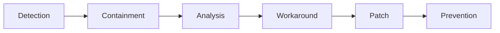

**Detection Methods:**

1. **Anomaly Detection Rules**:

   ```sql
   SELECT * FROM Process_Events 
   WHERE parent_process NOT IN (WHITELIST)
   AND process_path NOT IN (KNOWN_GOOD)
   ```

2. **Behavioral Analysis**:

   ```powershell
   # Monitor for unusual process chains
   Get-CimInstance Win32_Process | 
     Select-Object Name,ProcessId,ParentProcessId,CommandLine |
     Format-Table -AutoSize
   ```

3. **Memory Pattern Scanning**:

   ```bash
   # Yara scanning for memory artifacts
   yara64 -r /rules/apt.yar /memory.dump
   ```

## **3.Operational Playbooks**

### **3.1 Incident Severity Matrix (Expanded)**

| Level    | Technical Criteria                       | Business Impact  | Response SLA      | Escalation Path       | Documentation Requirements                  |
| -------- | ---------------------------------------- | ---------------- | ----------------- | --------------------- | ------------------------------------------- |
| Critical | Active data theft, ransomware encryption | >$1M impact      | 15 mins           | CISO + Legal + Board  | Full forensic report with executive summary |
| High     | Confirmed malware, lateral movement      | $100K-$1M impact | 1 hour            | SOC Manager + IR Team | Technical report with IOCs                  |
| Medium   | Suspicious activity, potential breach    | <$100K impact    | 4 hours           | Tier 2 Lead           | Brief investigation notes                   |
| Low      | False positive, non-malicious events     | No impact        | Next business day | Tier 1 Analyst        | Ticket documentation                        |

### **3.2 Shift Handover Process**

**Digital Handover Dashboard:**

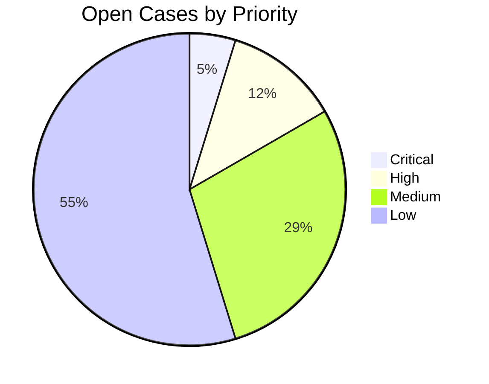

**Verbal Handover Script:**

```
"Shift handover for DD/MM/YYYY:
- Critical items:
  1. Case #123: Ongoing ransomware investigation (contained but needs remediation)
  2. Client ABC: Waiting for patch approval
- High priority:
  1. 3 new malware samples awaiting analysis
  2. SIEM rule tuning required for FP reduction
- Shift metrics:
  - 142 alerts processed
  - 87% SLA compliance
- Special notes:
  - Threat Intel bulletin about new APT29 TTPs
  - Scheduled maintenance tonight at 10PM"
```

## **4.Tool Integration Architecture**

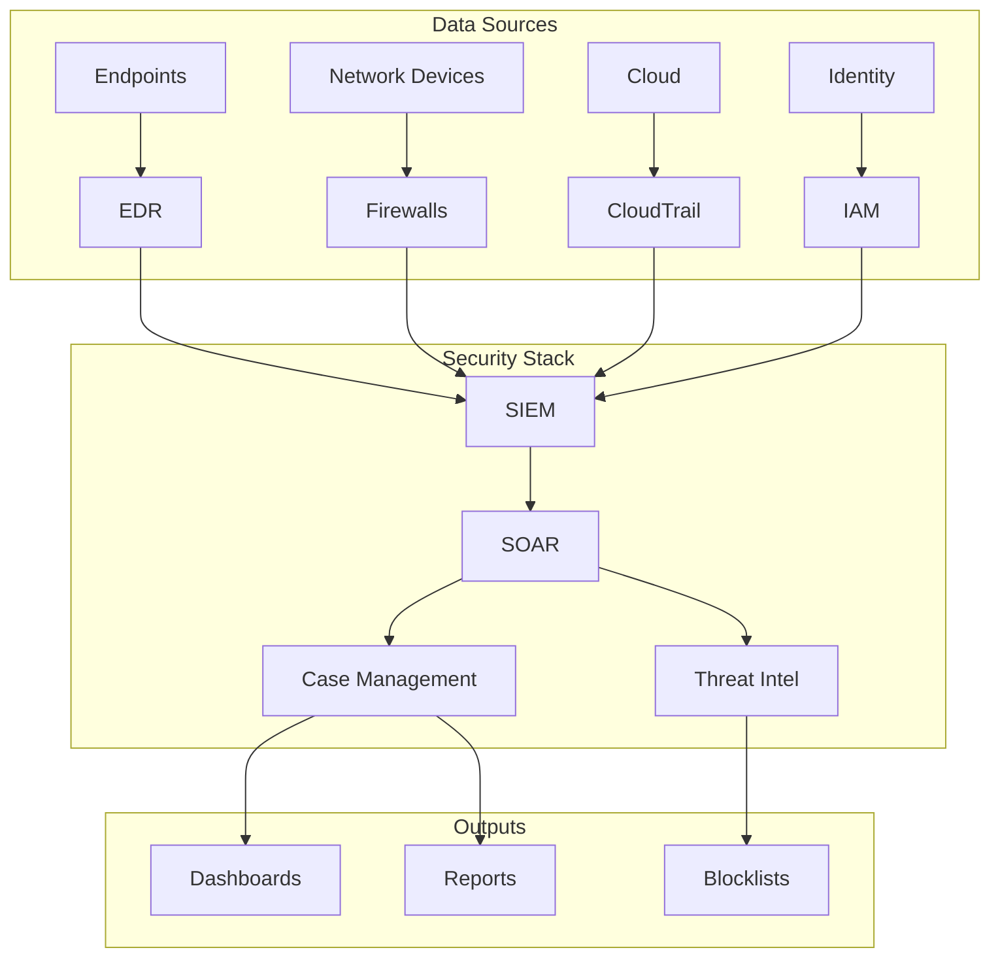

## **5.Incident Report Template**

**Executive Summary Section:**

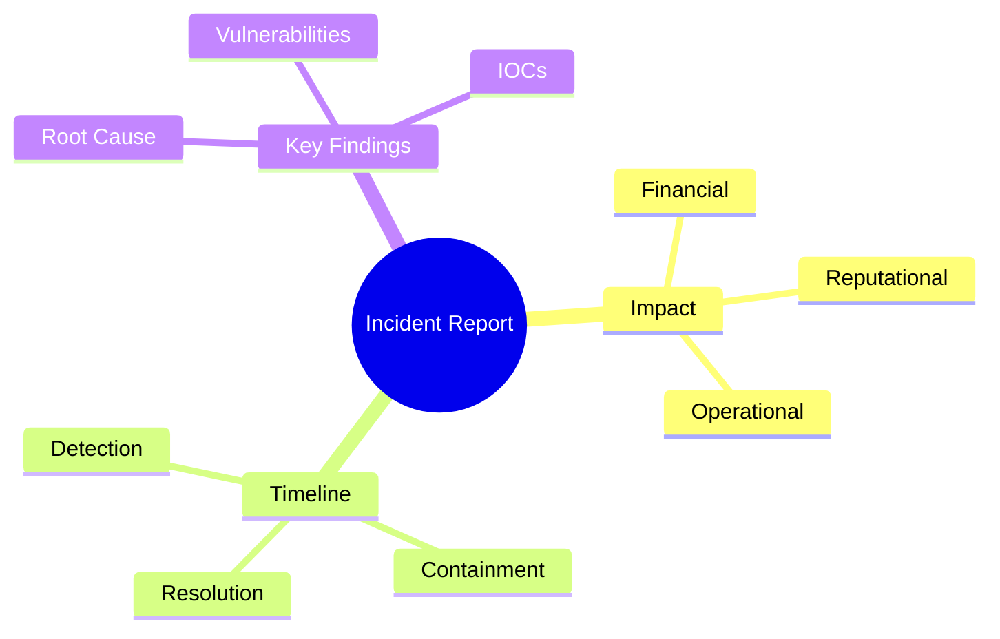

**Technical Details Expansion:**

1. **Forensic Artifacts**:

   - Memory analysis results
   - Disk forensic timelines
   - Network packet capture summaries

2. **Attack Chain Visualization**:

   ```mermaid
   graph LR
       A[Phishing Email] --> B[Macro Execution]
       B --> C[Cobalt Strike Beacon]
       C --> D[Lateral Movement]
       D --> E[Domain Admin Compromise]
   ```

3. **Remediation Verification**:

   ```bash
   # Verify patch installation
   rpm -qa | grep -i "openssl"
   
   # Confirm IOC eradication
   grep -r "192.168.1.100" /var/log/
   ```

## **6. New Additions: Specialized Response Playbooks**

### **6.1 Cloud Security Incident Response**

**AWS Compromise Workflow:**

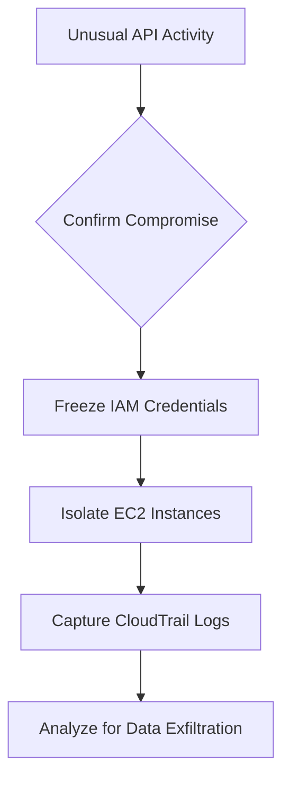

**Critical Commands:**

```bash
# List all unauthorized API calls
aws cloudtrail lookup-events --lookup-attributes AttributeKey=EventName,AttributeValue=ConsoleLogin

# Check for anomalous S3 access
aws s3api list-buckets --query "Buckets[].Name" | while read bucket; do
  aws s3api get-bucket-acl --bucket "$bucket"
done
```

### **6.2 Insider Threat Program**

**Detection Methodology:**

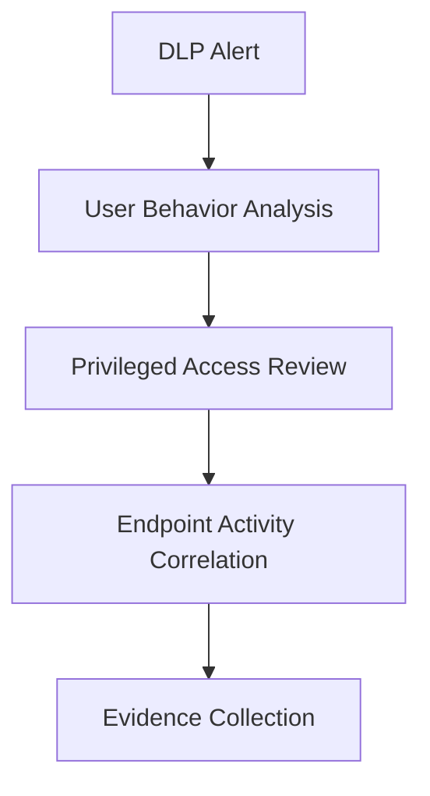

**Investigation Checklist:**

1. Review file access patterns:

   ```powershell
   Get-WinEvent -LogName Security | 
     Where-Object {$_.ID -eq 4663 -and $_.Properties[8].Value -eq "user123"}
   ```

2. Analyze email forwarding rules:

   ```powershell
   Get-InboxRule -Mailbox suspect@domain.com | 
     Select-Object Name,Enabled,RedirectTo,ForwardTo
   ```

3. Check USB usage history:

   ```powershell
   Get-WinEvent -LogName Microsoft-Windows-DriverFrameworks-UserMode/Operational | 
     Where-Object {$_.ID -eq 2003}
   ```

## **7.Training & Readiness**

### **7.1 Red Team Exercise Framework**

**Simulation Timeline:**

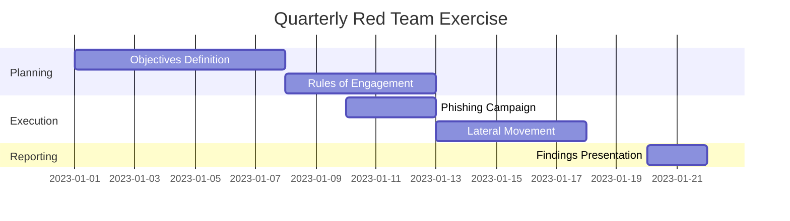

### **7.2 Tabletop Exercise Scenarios**

**Scenario 1: Supply Chain Compromise**

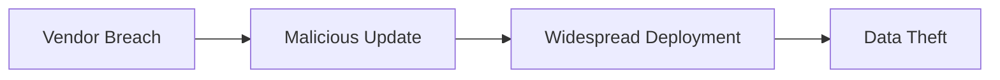

**Discussion Points:**

1. How would we detect this?
2. What containment strategies would work?
3. How to communicate with affected clients?

## **8.Appendices**

### **8.1 Command Reference Cheat Sheets**

**Linux Forensic Commands:**

```bash
# Process analysis
ps -auxf --forest

# Open files
lsof -i +c 0

# File timeline
find / -type f -printf "%T+ %p\n" | sort -n
```

**Windows Hunting Commands:**

```powershell
# Scheduled tasks
schtasks /query /fo LIST /v

# Service anomalies
Get-WmiObject win32_service | 
  Where-Object {$_.PathName -notmatch "system32"} |
  Select-Object Name,PathName
```

### **8.2 Threat Actor TTP Database**

---

| Group | Preferred Initial Access | Common Tools | Detection Signatures |
|---|---|---|---|
| **APT29** | Phishing with DOCX | Cobalt Strike | Office spawning PS |
| **FIN7** | Malicious LNK files | Carbanak | LNK downloading DLL |
| **Lazarus** | Exploit Kits, Phishing (Spearphishing), Supply Chain Attacks | **Manuscrypt, Destover** | **Suspicious PowerShell/DLL execution from temp folders; C2 traffic to known IPs/domains; Registry/Scheduled Task persistence** |

---


Mandiant also identified APT29 utilizing a malicious docx to deliver an HTA dropper, resulting in the delivery and execution of BEATDROP on a target system, in a separate but similar phishing campaign.


---

## PowerShell Archaeology: FIN7's Enduring Affinity

It's undeniable: PowerShell is FIN7's preferred method of communication. While FIN7 has incorporated malware written in numerous programming languages into their attack campaigns, their strong inclination for custom PowerShell-based loaders and distinct PowerShell commands stands out during direct system interaction.

Our in-depth analysis of previous FIN7 breaches, extending back to 2019, revealed several persistent patterns of unusual PowerShell commands that they continue to employ today. For instance, command lines similar to those shown in Figure 2 and Figure 3 exhibited very low global usage outside of FIN7's operations and suspected unclassified threat groups (UNCs) associated with them.

```
cmd.exe /c start %SYSTEMROOT%\system32\WindowsPowerShell\v1.0\powershell.exe -noni 
-nop -exe bypass -f <REDACTED>/ADMIN$/temp/wO9EBGmDqwdc.ps1
```
Figure 2: FIN7 PowerShell Execution from 2019

```
cmd.exe /c start %SYSTEMROOT%\system32\WindowsPowerShell\v1.0\powershell.exe -noni 
-nop -exe bypass -f \\<REDACTED>\Admin$\c5k3fsys.3bp.ps1
```
Figure 3: FIN7 PowerShell Execution from 2021

What makes the commands in Figure 2 and Figure 3 unique are the specific parameters **-noni -nop -exe bypass -f**, used for initiating scripts located on Admin shares and setting up Windows services. Since 2019, we've observed FIN7 utilizing such command-line parameters when engaging with compromised systems, often via backdoor malware like CARBANAK. More recently, we've noted a shift where some of these distinctive PowerShell commands are being launched through POWERPLANT compromises.

### More on FIN7's PowerShell Techniques

Besides the specific command lines FIN7 uses during their attacks, we also discovered their consistent use of other PowerShell script variants, like **POWERTRASH**. This tool acts as an **in-memory dropper** or **loader**, coded in PowerShell, designed to run a hidden malicious payload. We've seen FIN7's POWERTRASH deliver various payloads, including **CARBANAK, DICELOADER, SUPERSOFT, BEACON**, and **PILLOWMINT**. POWERTRASH is a distinct, **obfuscated (hidden)** version of a shellcode invoker that's part of the **PowerSploit** framework, which is publicly available on GitHub.

```powershell
powershell.exe -ex bypass -file C:\windows\temp\fdddu32.ps1
```
Figure 4: FIN7 PowerShell Execution from 2019

```powershell
powershell.exe -ex bypass -f c:\users\public\temp\AC-Win10w-x64.ps1
powershell.exe -ex bypass -f C:\Users\Public\Videos\AC-Bot-x64.ps1
```
Figure 5: FIN7 PowerShell Execution from 2020

```powershell
powershell.exe -ex bypass -f pkit.ps1                    
powershell.exe -ex bypass -f cube.ps1
```
Figure 6: FIN7 PowerShell Executions from 2021

With this better insight into how FIN7 operates, we started combining various suspected unidentified threat groups (UNCs) under the FIN7 designation. Through this work, we pinpointed new FIN7 campaigns aimed at our clients, including a **Managed Defense Rapid Response** involvement in 2021.

------

## Understanding the Lazarus Supply-Chain Attack
To grasp this innovative supply-chain attack, you should know that internet users in South Korea frequently need to install extra security software when they visit government or online banking platforms.

WIZVERA VeraPort, which acts as an integration installation program, is a South Korean application designed to oversee this supplementary security software. Once WIZVERA VeraPort is on a user's device, it allows them to receive and install all the necessary software a particular website needs (for example, browser plug-ins, security applications, identity verification tools, etc.) with minimal effort. This software is typically used by South Korean government and banking sites. For some of these websites, having WIZVERA VeraPort installed is a mandatory requirement for users to access their services.


### A WIZVERA VeraPort window displayed to the user when installing additional software

### How Lazarus Exploited WIZVERA VeraPort

The Lazarus attackers leveraged the aforementioned process for installing security software to deploy their malware from a legitimate, yet compromised, website. It's worth noting, however, that successfully delivering malware this way depended on several prerequisites; that's why Lazarus used it in only a few campaigns. For this attack to work:

* The victim needed to have WIZVERA VeraPort software already installed.
* The victim had to visit a compromised website that supported WIZVERA VeraPort.
* This specific website had to contain particular entries in its VeraPort configuration file, allowing the attackers to swap out standard software in its VeraPort bundle with their malware.

Based on our analysis, it's crucial to understand that we believe these supply-chain attacks happened on websites that *use* WIZVERA VeraPort, rather than directly targeting WIZVERA itself.

Websites that support WIZVERA VeraPort software include a server-side element, specifically some JavaScript files and a WIZVERA configuration file. This configuration file is an XML document encoded in base64, holding details like the website's address, a list of software to install, download links, and other settings.


### An example of a WIZVERA VeraPort configuration (redacted by ESET)

### Circumventing Digital Signatures
These configuration files carry WIZVERA's digital signature. After being downloaded, they undergo verification using a robust cryptographic algorithm (RSA). This strong security measure explains why attackers can't easily alter the content of these configuration files or establish their own counterfeit websites. Nevertheless, the attackers can swap out the software delivered to WIZVERA VeraPort users if they operate from a legitimate but compromised website. We believe this is precisely the scenario the Lazarus attackers exploited.

### Simplified scheme of the WIZVERA supply-chain attack conducted by the Lazarus group

---

### How VeraPort's Signature Check Is Overcome

It's worth noting that WIZVERA VeraPort's configuration offers a function to **verify the digital signature of binary files** it downloads before they execute. This option is typically active by default. However, VeraPort's check is limited to confirming the signature's **validity**, without actually confirming the **identity of the certificate holder**. Consequently, for attackers to misuse WIZVERA VeraPort, they merely require any legitimate code-signing certificate to deploy their harmful programs, or they might get lucky and encounter a VeraPort installation where signature validation isn't even mandated.

To date, we've identified two examples of malware distributed via this supply-chain compromise, both of which carried digital signatures:

| SHA-1 | Filename | Digital Signature |
|---|---|---|
| 3D311117D09F4A6AD300E471C2FB2B3C63344B1D | Delfino.exe | ALEXIS SECURITY GROUP, LLC |
| 3ABFEC6FC3445759730789D4322B0BE73DC695C7 | MagicLineNPIZ.exe | DREAM SECURITY USA INC |

The threat actors resorted to using **unlawfully obtained code-signing certificates** to sign these malicious samples. Interestingly, one of these certificates was issued to the American branch of a South Korean cybersecurity company.

### The ALEXIS SECURITY GROUP, LLC code-signing certificate used to sign Lazarus malware

### The DREAM SECURITY USA INC code-signing certificate used to sign Lazarus malware


------
# Refrences:

SOC Structure & Roles:

[NIST SP 800-61r2](https://csrc.nist.gov/pubs/sp/800/61/r2/final)

[SANS](https://www.sans.org/media/analyst-program/common-practices-security-operations-centers-results-2019-soc-survey-39060.pdf)

[SANS](https://www.sans.org/posters/guide-to-security-operations/)

[MITRE News & Insights](https://www.mitre.org/news-insights)

[Google Cloud Blog](https://cloud.google.com/blog/topics/threat-intelligence/tracking-apt29-phishing-campaigns)

[Google Cloud Blog](https://cloud.google.com/blog/topics/threat-intelligence/evolution-of-fin7)

[ESET Research By Anton Cherepanov & Peter Kálnai](https://www.welivesecurity.com/2020/11/16/lazarus-supply-chain-attack-south-korea/)

[AWS Doc](https://docs.aws.amazon.com/cli/latest/reference/cloudtrail/lookup-events.html)

[MITRE ATTACK](https://attack.mitre.org/)

For ongoing validation:

[CISA](https://www.cisa.gov/known-exploited-vulnerabilities-catalog)

[NIST NVD](https://nvd.nist.gov/)

[krebsOnSecurity](https://krebsonsecurity.com/)
