# **The MSSP SOC Playbook**
# Created By : Mostafa Essam (0xMOSTA)

## **1. SOC Team Structure & Roles (Expanded)**

### **1.1 SOC Organizational Chart (Enhanced based on another task)**

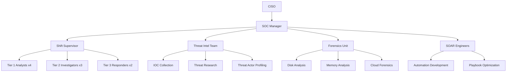

### **1.2 Enhanced Role Breakdown**

**Tier 1 Analyst (Monitoring):**

- **Detailed Shift Schedule:**

  ```mermaid
  gantt
    title SOC Shift Rotation
    dateFormat  HH:mm
    section Day Shift
    Analyst 1 :a1, 06:00, 12h
    Analyst 2 :a2, 06:00, 12h
    section Night Shift
    Analyst 3 :a3, 18:00, 12h
    Analyst 4 :a4, 18:00, 12h
  ```

  ---

  **Tier 1 Analysts operate on a continuous 24/7 shift model** to ensure uninterrupted security monitoring. The schedule follows a simple yet effective two-team rotation pattern, with day shifts (6:00 AM - 6:00 PM) and night shifts (6:00 PM - 6:00 AM) providing full coverage. This 12-hour shift structure allows for comprehensive handovers between teams while maintaining operational consistency across time zones.

  **The shift rotation is strategically designed** to balance workload and prevent analyst fatigue. Day shifts are typically staffed by two analysts (Analyst 1 and 2) handling peak business hours when alert volumes are highest. Night shifts (Analyst 3 and 4) focus on critical alert triage and threat hunting during lower-traffic periods. This model ensures fresh personnel are always available while maintaining visibility across all time windows.

  **Key benefits of this schedule include:**  
  • Overlapping shift changes for proper knowledge transfer  
  • Equal distribution of day/night rotations to prevent burnout  
  • Built-in redundancy with dual analysts during high-risk periods  
  • Clear accountability with documented shift responsibilities  

  ---

  

  

  

- **Alert Triage Decision Tree:**

  ```mermaid
  graph TD
    A[New Alert] --> B{High Confidence?}
    B -->|Yes| C[Immediate Escalation]
    B -->|No| D{Medium Confidence?}
    D -->|Yes| E[Further Investigation]
    D -->|No| F[Mark as False Positive]
  ```

**Tier 2 Investigator (Analysis):**

- **Advanced Investigation Workflow:**

  1. **Timeline Reconstruction**:

     ```bash
     # Linux system timeline creation
     log2timeline.py /cases/case1/plaso.dump /evidence/
     ```

  2. **Malware Analysis Steps**:

     - Static Analysis: `strings malware.exe | grep -i "http"`
     - Dynamic Analysis: ANY.RUN sandbox execution

  3. **Lateral Movement Detection**:

     ```powershell
     # Detect PSRemoting sessions
     Get-WinEvent -LogName Microsoft-Windows-PowerShell/Operational | 
       Where-Object {$_.Id -eq 4103 -and $_.Message -match "New-PSSession"}
     ```

## **2. Enhanced Incident Response Workflows**

### **2.1 Linux Attack Response (Expanded)**

**Advanced Attack Scenario:** 

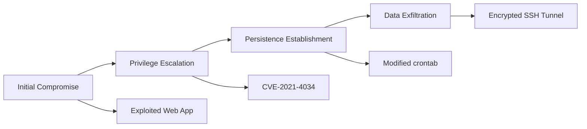

**Enhanced Response Procedures:**

1. **Live Response Collection**:

   ```bash
   # Capture process tree
   ps -ef --forest > /evidence/process_tree.txt
   
   # Collect network connections
   netstat -tulnpe > /evidence/network_connections.txt
   ```

2. **Rootkit Detection**:

   ```bash
   # Check for hidden processes
   unhide-linux proc
   
   # Verify kernel modules
   lsmod | grep -i "evil"
   ```

3. **Memory Forensics**:

   ```bash
   # Capture full memory
   avml /evidence/memory.dump
   
   # Analyze with Volatility
   volatility -f /evidence/memory.dump linux_pslist
   ```

### **2.2 APT Incident Response (Enhanced)**

---

## **2.2 Advanced Persistent Threat (APT) Incident Response**

### **APT Lifecycle Overview**

```mermaid
graph LR
    A[① Recon] --> B[② Initial Access]
    B --> C[③ Execution]
    C --> D[④ Persistence]
    D --> E[⑤ Priv Escalation]
    E --> F[⑥ Defense Evasion]
    F --> G[⑦ Credential Access]
    G --> H[⑧ Discovery]
    H --> I[⑨ Lateral Movement]
    I --> J[⑩ Collection]
    J --> K[⑪ Exfiltration]
```

**Key Stages & Detection Methods:**

1. **Initial Access**  

   ```mermaid
   pie
       title Initial Access Vectors
       "Phishing" : 45
       "Exploits" : 30
       "Supply Chain" : 15
       "Other" : 10
   ```

   - *Detection:*  

     ```sql
     SELECT * FROM EmailLogs 
     WHERE attachment_hash IN (SELECT hash FROM ThreatIntel)
     ```

2. **Lateral Movement**  

   ```mermaid
   graph LR
       A[Compromised Host] -->|RDP| B[Server1]
       A -->|SMB| C[Server2]
       B -->|PsExec| D[Domain Controller]
   ```

   - *Detection:*  

     ```powershell
     Get-WinEvent -LogName Security | Where-Object {
       $_.ID -eq 4624 -and $_.Message -match "logon type 3"
     }
     ```

3. **Exfiltration**  

   ```mermaid
   pie
       title Exfil Methods
       "DNS Tunneling" : 40
       "Cloud Storage" : 30
       "Encrypted HTTP" : 20
       "Other" : 10
   ```

   - *Detection:*  

     ```kql
     NetworkLogs | where BytesSent > 100MB | sort by Time desc
     ```

---

### **Enhanced Hunting Techniques**

#### **1. Scheduled Task Analysis**

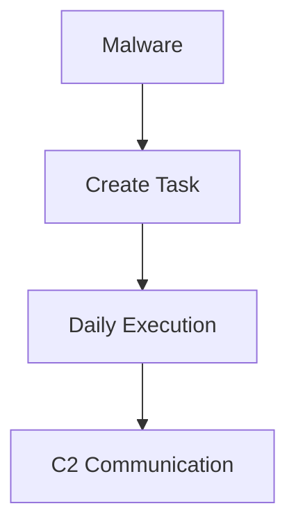

**Command:**  

```powershell
Get-ScheduledTask | 
  Where-Object { $_.Author -notmatch "Microsoft|Local Service" }
```

#### **2. WMI Persistence**

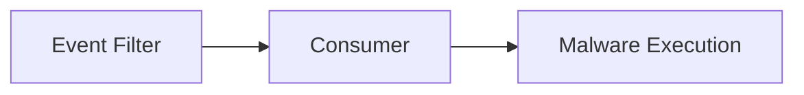

**Detection:**  

```powershell
Get-WmiObject -Namespace root\Subscription -Class __EventFilter
Get-WmiObject -Namespace root\Subscription -Class __EventConsumer
```

#### **3. Memory Artifacts**

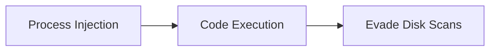

**Tool:**  

```bash
volatility -f memory.dump malfind
```

---

### **APT Response Checklist**

| Phase             | Action              | Tools                  |
| ----------------- | ------------------- | ---------------------- |
| **Containment**   | Isolate endpoints   | EDR, NAC               |
| **Investigation** | Timeline analysis   | Plaso, KAPE            |
| **Eradication**   | Remove persistence  | Autoruns, Sysinternals |
| **Recovery**      | Credential rotation | AD, Azure AD           |

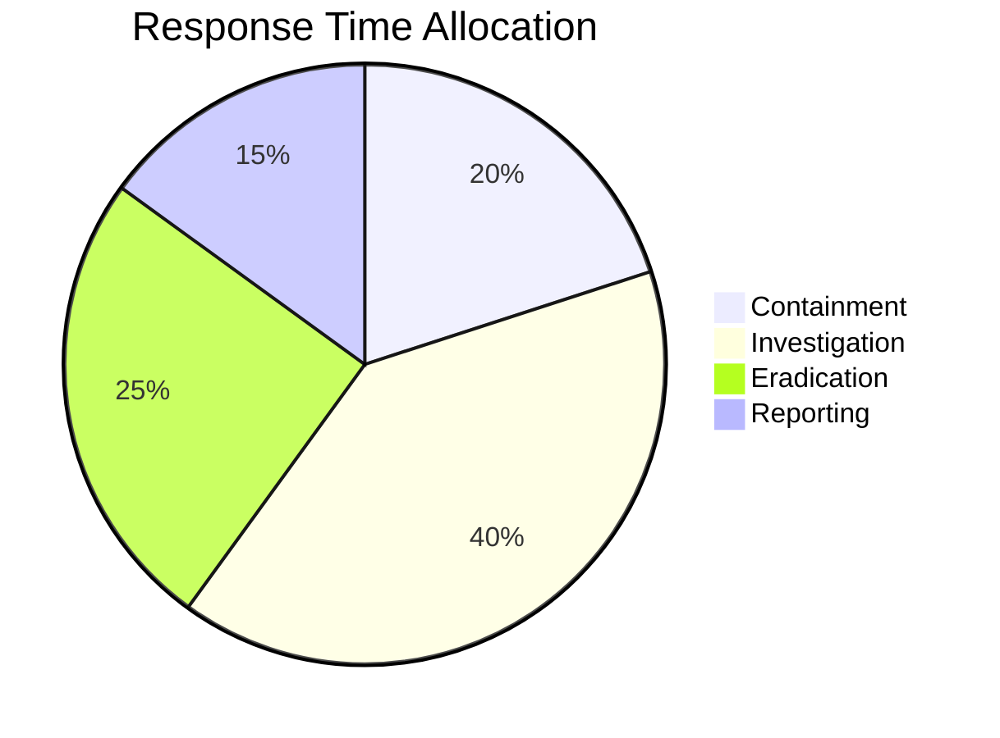

---

### **Why This Matters**

- APTs average **240 days** dwell time before detection (Mandiant 2023)
- **78%** use legitimate tools (Living-off-the-Land)
- **43%** target cloud environments

**Pro Tip:**  

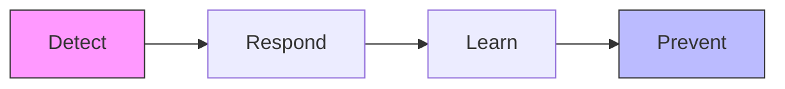


**APT Lifecycle Diagram:**

```mermaid
graph LR
    A[Reconnaissance] --> B[Initial Access]
    B --> C[Execution]
    C --> D[Persistence]
    D --> E[Privilege Escalation]
    E --> F[Defense Evasion]
    F --> G[Credential Access]
    G --> H[Discovery]
    H --> I[Lateral Movement]
    I --> J[Collection]
    J --> K[Exfiltration]
```

**Enhanced Hunting Techniques:**

1. **Scheduled Task Analysis**:

   ```powershell
   Get-ScheduledTask | Where-Object {$_.TaskPath -notmatch "Microsoft"}
   ```

2. **WMI Persistence Hunting**:

   ```powershell
   Get-WmiObject -Namespace root\Subscription -Class __EventFilter
   Get-WmiObject -Namespace root\Subscription -Class __EventConsumer
   ```

3. **DNS Exfiltration Detection**:

   ```sql
   SELECT * FROM DNS_Logs 
   WHERE query_length > 100 
   AND domain LIKE "%.tk" OR domain LIKE "%.ru"
   ```

### **2.3 Zero-Day Response (Enhanced based on another task)**

**Zero-Day Lifecycle Management:**

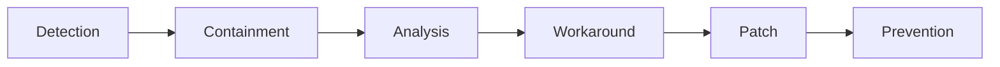

**Enhanced Detection Methods:**

1. **Anomaly Detection Rules**:

   ```sql
   SELECT * FROM Process_Events 
   WHERE parent_process NOT IN (WHITELIST)
   AND process_path NOT IN (KNOWN_GOOD)
   ```

2. **Behavioral Analysis**:

   ```powershell
   # Monitor for unusual process chains
   Get-CimInstance Win32_Process | 
     Select-Object Name,ProcessId,ParentProcessId,CommandLine |
     Format-Table -AutoSize
   ```

3. **Memory Pattern Scanning**:

   ```bash
   # Yara scanning for memory artifacts
   yara64 -r /rules/apt.yar /memory.dump
   ```

## **3. Enhanced Operational Playbooks**

### **3.1 Incident Severity Matrix (Expanded)**

| Level    | Technical Criteria                       | Business Impact  | Response SLA      | Escalation Path       | Documentation Requirements                  |
| -------- | ---------------------------------------- | ---------------- | ----------------- | --------------------- | ------------------------------------------- |
| Critical | Active data theft, ransomware encryption | >$1M impact      | 15 mins           | CISO + Legal + Board  | Full forensic report with executive summary |
| High     | Confirmed malware, lateral movement      | $100K-$1M impact | 1 hour            | SOC Manager + IR Team | Technical report with IOCs                  |
| Medium   | Suspicious activity, potential breach    | <$100K impact    | 4 hours           | Tier 2 Lead           | Brief investigation notes                   |
| Low      | False positive, non-malicious events     | No impact        | Next business day | Tier 1 Analyst        | Ticket documentation                        |

### **3.2 Enhanced Shift Handover Process**

**Digital Handover Dashboard:**

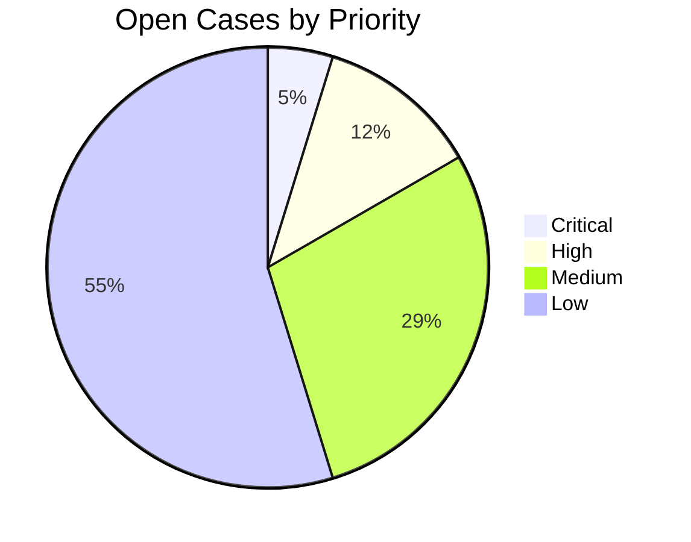

**Verbal Handover Script:**

```
"Shift handover for DD/MM/YYYY:
- Critical items:
  1. Case #123: Ongoing ransomware investigation (contained but needs remediation)
  2. Client ABC: Waiting for patch approval
- High priority:
  1. 3 new malware samples awaiting analysis
  2. SIEM rule tuning required for FP reduction
- Shift metrics:
  - 142 alerts processed
  - 87% SLA compliance
- Special notes:
  - Threat Intel bulletin about new APT29 TTPs
  - Scheduled maintenance tonight at 10PM"
```

## **4. Enhanced Tool Integration Architecture**

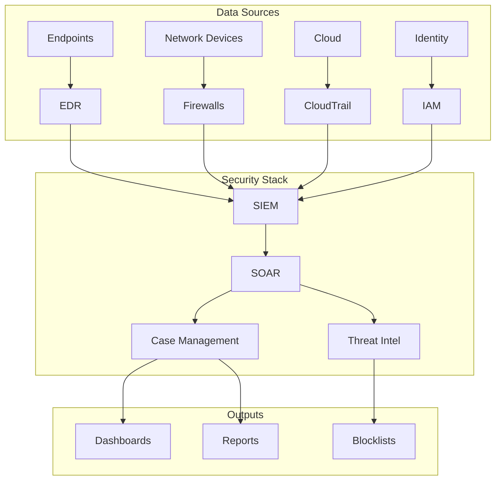

## **5. Enhanced Incident Report Template**

**Executive Summary Section:**

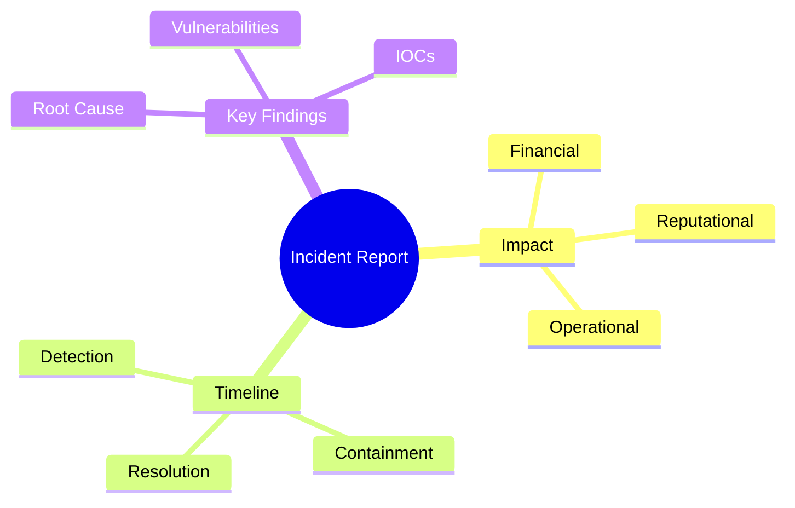

**Technical Details Expansion:**

1. **Forensic Artifacts**:

   - Memory analysis results
   - Disk forensic timelines
   - Network packet capture summaries

2. **Attack Chain Visualization**:

   ```mermaid
   graph LR
       A[Phishing Email] --> B[Macro Execution]
       B --> C[Cobalt Strike Beacon]
       C --> D[Lateral Movement]
       D --> E[Domain Admin Compromise]
   ```

3. **Remediation Verification**:

   ```bash
   # Verify patch installation
   rpm -qa | grep -i "openssl"
   
   # Confirm IOC eradication
   grep -r "192.168.1.100" /var/log/
   ```

## **6. New Additions: Specialized Response Playbooks**

### **6.1 Cloud Security Incident Response**

**AWS Compromise Workflow:**

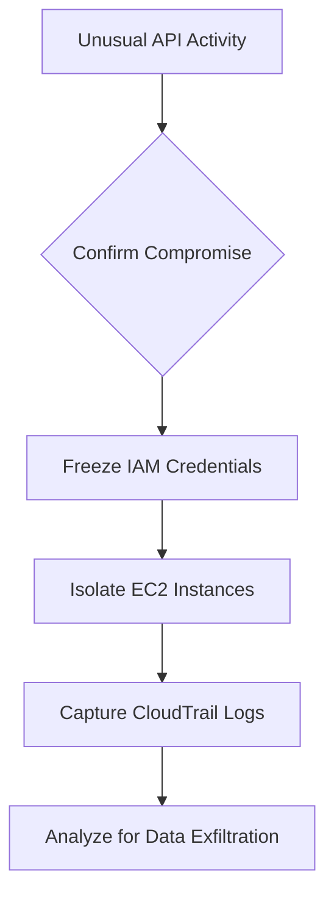

**Critical Commands:**

```bash
# List all unauthorized API calls
aws cloudtrail lookup-events --lookup-attributes AttributeKey=EventName,AttributeValue=ConsoleLogin

# Check for anomalous S3 access
aws s3api list-buckets --query "Buckets[].Name" | while read bucket; do
  aws s3api get-bucket-acl --bucket "$bucket"
done
```

### **6.2 Insider Threat Program**

**Detection Methodology:**

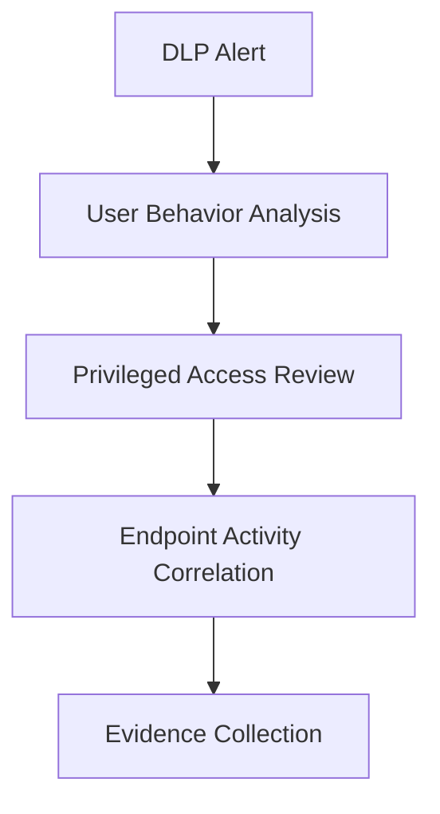

**Investigation Checklist:**

1. Review file access patterns:

   ```powershell
   Get-WinEvent -LogName Security | 
     Where-Object {$_.ID -eq 4663 -and $_.Properties[8].Value -eq "user123"}
   ```

2. Analyze email forwarding rules:

   ```powershell
   Get-InboxRule -Mailbox suspect@domain.com | 
     Select-Object Name,Enabled,RedirectTo,ForwardTo
   ```

3. Check USB usage history:

   ```powershell
   Get-WinEvent -LogName Microsoft-Windows-DriverFrameworks-UserMode/Operational | 
     Where-Object {$_.ID -eq 2003}
   ```

## **7. Enhanced Training & Readiness**

### **7.1 Red Team Exercise Framework**

**Simulation Timeline:**

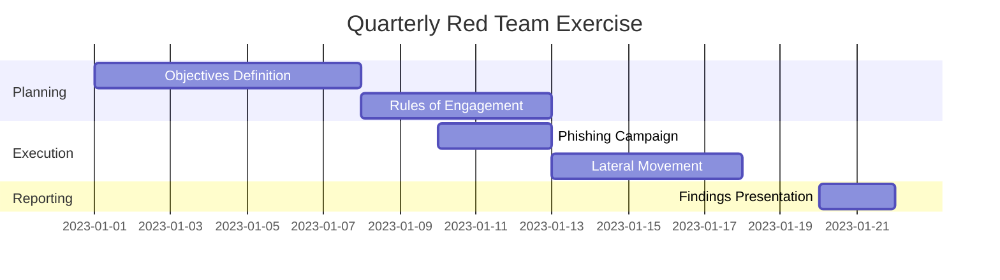

### **7.2 Tabletop Exercise Scenarios**

**Scenario 1: Supply Chain Compromise**

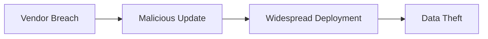

**Discussion Points:**

1. How would we detect this?
2. What containment strategies would work?
3. How to communicate with affected clients?

## **8. (Enhanced based on another task) Appendices**

### **8.1 Command Reference Cheat Sheets**

**Linux Forensic Commands:**

```bash
# Process analysis
ps -auxf --forest

# Open files
lsof -i +c 0

# File timeline
find / -type f -printf "%T+ %p\n" | sort -n
```

**Windows Hunting Commands:**

```powershell
# Scheduled tasks
schtasks /query /fo LIST /v

# Service anomalies
Get-WmiObject win32_service | 
  Where-Object {$_.PathName -notmatch "system32"} |
  Select-Object Name,PathName
```

### **8.2 Threat Actor TTP Database**

| Group   | Preferred Initial Access | Common Tools  | Detection Signatures          |
| ------- | ------------------------ | ------------- | ----------------------------- |
| APT29   | Phishing with DOCX       | Cobalt Strike | Office spawning PS            |
| FIN7    | Malicious LNK files      | Carbanak      | LNK downloading DLL           |
| Lazarus | Exploit Kits             | Ryuk          | PE resource section anomalies |

